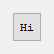
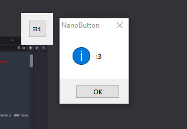

<h1 align="center">
NanoButton
</h1>

 
  <kbd>

  </kbd>

<h3 align="center">
by bang1338 :3
</h3>  

- Difficulty: Normal?

## Challenge
- Press the button "Hi"
- If correctly bypass, a MessageBox with `:3` show up.

#### Aditional info
- To exit, use `Alt` + `F4`

 
  <kbd>

  </kbd>

<h5 align="center">
can't move the dialog, sorry >.<

## Rules and Requirement:
#### Rules:
1. Patch? Here's a deal: 
- No patching if you're unpacked UPX, as final result! 
- Allowed patching if you're not unpacked UPX, as final result! 
- only patch-fix the flaw like missing stdc dll, or temporary byte patch to making loader or hook
2. Spoiling? No! (a lot of pro cracker split the answer on comment...)
3. Keygen? useless. Because the goal is bypass it!
4. Hooking? Allowed! It's not a patch!
5. Loader? Allowed! It's just a mem patch, not file patch...
6. Any these above, do not use any tool to create stuff like Baymax or dUP2, but you can create your own one with coding.

#### Requirement:
- Assembly/C++ skill
- Any debugger you love! (__x32dbg__, OllyDbg,...) - **Recommend!**
- Any disassembler you love! (IDA, Binary Ninja, Ghidra,...) **Recommend!**

## Credit
- Elvis, for testing

## Bonus

 
  <kbd>

  </kbd>

## Further note of this
- For god sake please use markdown viewer for reading, recommend GitHub style :v
- I will using crackmes.one ID instead... wait i can just highlight link :v
- I will using image directly instead of using Discord for hosting.

##### bang1338, 2024.