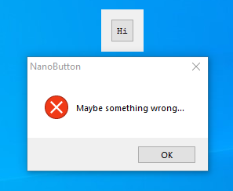
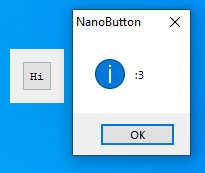
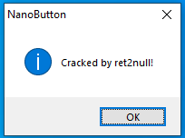

**bang1338's NanoButton**  
<https://crackmes.one/crackme/659e9ccbeef082e477ff5948>

```
#### Rules:
1. Patch? Here's a deal: 
- No patching if you're unpacked UPX, as final result! 
- Allowed patching if you're not unpacked UPX, as final result! 
- only patch-fix the flaw like missing stdc dll, or temporary byte patch to making loader or hook
2. Spoiling? No! (a lot of pro cracker split the answer on comment...)
3. Keygen? useless. Because the goal is bypass it!
4. Hooking? Allowed! It's not a patch!
5. Loader? Allowed! It's just a mem patch, not file patch...
6. Any these above, do not use any tool to create stuff like Baymax or dUP2, but you can create your own one with coding.
```

# Challenge

```
$ file NanoButton.exe
NanoButton.exe: PE32 executable (GUI) Intel 80386 (stripped to external PDB), for MS Windows, UPX compressed
```

Default interaction:




We click the ```Hi``` button and get a MessageBox with the text ```Maybe something wrong...```  According to the instructions, we want to get a MessageBox with the message ```:3``` without patching (though hooking is allowed.)

We can unpack this with UPX (<https://upx.github.io/>) to get the original binary to analyze and go from there.

```
C:\Users\charl\Desktop\crackmes\nanobutton>copy nanobutton.exe nano_unpacked.exe
        1 file(s) copied.

C:\Users\charl\Desktop\crackmes\nanobutton>upx -d nano_unpacked.exe
                       Ultimate Packer for eXecutables
                          Copyright (C) 1996 - 2024
UPX 4.2.2       Markus Oberhumer, Laszlo Molnar & John Reiser    Jan 3rd 2024

        File size         Ratio      Format      Name
   --------------------   ------   -----------   -----------
    133632 <-    123392   92.34%    win32/pe     nano_unpacked.exe

Unpacked 1 file.
```

The new binary is essentially the same format minus the compression:
```
$ file nano_unpacked.exe
nano_unpacked.exe: PE32 executable (GUI) Intel 80386 (stripped to external PDB), for MS Windows
```

# Diving in

If the only goal is to make it display a MessageBox with different text, we can just hook whichever version of MessageBox it uses and replace what's displayed.

That kind of feels like cheating because we're not so much changing the program logic as we are just painting over it.

Let's see what the logic in question actually looks like in IDA:
```
.text:00401420                 cmp     ds:byte_408008, 0
.text:00401427                 jnz     short success
.text:00401429                 mov     [esp+1Ch+uType], 10h ; uType
.text:00401431                 mov     [esp+1Ch+lpCaption], offset Caption ; "NanoButton"
.text:00401439                 mov     [esp+1Ch+lpText], offset aMaybeSomething ; "Maybe something wrong..."

.text:00401441 display_msg:
.text:00401441                 mov     eax, [esp+1Ch+hDlg]
.text:00401445                 mov     [esp+1Ch+hWnd], eax ; hWnd
.text:00401448                 call    MessageBoxA
.text:0040144D                 sub     esp, 10h
.text:00401450                 mov     eax, 1
.text:00401455                 add     esp, 1Ch
.text:00401458                 retn    10h

.text:0040145C success:
.text:0040145C                 mov     [esp+1Ch+uType], 40h ; '@'
.text:00401464                 mov     [esp+1Ch+lpCaption], offset Caption ; "NanoButton"
.text:0040146C                 mov     [esp+1Ch+lpText], offset a3 ; ":3"
.text:00401474                 jmp     short display_msg
```

This entire check depends on the value at ```408008```, which doesn't seem to be overwritten anywhere else. If we change this to a non-zero value, we should reach the success branch.

We can patch this location to another value in a debugger and verify that it works as expected.  An important note here is that with some other unpackers, the address of this memory could be subject to change and we would need to calculate an offset from the **WindowProc** or some other available address, but UPX does a good job of ensuring everything loads where you would normally expect so we don't need to worry about it.

Let's write our hotfix.

# Solution

Our solution is about as straightforward as it gets (see **solution** folder for project files):
```
#include <iostream>
#include <Windows.h>

// Verification info
wchar_t TARGET[] = L"NanoButton.exe";
uintptr_t verify_addr = 0x408008;

// Tagging info -- tag strlen needs to be <=20 chars to fit
uintptr_t splashtxt_addr = 0x40602F;
constexpr char tag[] = "Cracked by ret2null!";

int main()
{
	// Launch the target
	STARTUPINFO si = { 0 };
	PROCESS_INFORMATION pi = { 0 };
	si.cb = sizeof(si);

	std::wcout << L"Launching target: \"" << TARGET << "\"... ";

	if (!CreateProcessW(NULL, TARGET, NULL, NULL, FALSE, 0, NULL, NULL, &si, &pi))
	{
		std::wcout << L"Failed to launch target: " << TARGET << '\n';
		std::cout << "Error code: " << GetLastError() << std::endl;
		return -1;
	}

	std::cout << "Success!\n";
	std::cout << "Giving target a second to unpack...";

	// Give it a couple seconds to start up and unpack
	// You may need to adjust this on your system
	// If we wanted to be more precise about it, we could hook eg. DialogBoxParamA
	// which only occurs after unpacking is complete
	Sleep(2000);
		
	std::cout << "\nHot patching target... ";

	// Change the verification byte to a non-zero value
	char good = 1;

	if (!WriteProcessMemory(pi.hProcess, (LPVOID) verify_addr, &good, 1, NULL))
	{
		std::cout << "Failed to set verified byte\n";
		std::cout << "Error code: " << GetLastError() << std::endl;
		return -1;
	}

	// Tag it
	DWORD old_protect;

	if (!VirtualProtectEx(pi.hProcess, (LPVOID) splashtxt_addr, sizeof(tag), PAGE_READWRITE, &old_protect) ||
		!WriteProcessMemory(pi.hProcess, (LPVOID)splashtxt_addr, tag, sizeof(tag), NULL))
	{
		std::cout << L"Failed to tag exit splash message box\n";
		std::cout << "The verification bypass should still work\n";
		std::cout << "Error code: " << GetLastError() << std::endl;
		return -1;
	}

	std::cout << "Success!\n";

	// Clean up and exit. Target will remain running.
	DWORD ignored;
	VirtualProtectEx(pi.hProcess, (LPVOID)splashtxt_addr, sizeof(tag), old_protect, &ignored);

	CloseHandle(pi.hProcess);
	CloseHandle(pi.hThread);

	return 0;
}
```

And we get the result we are looking for:



And of course... ;)



Nice!

QED
